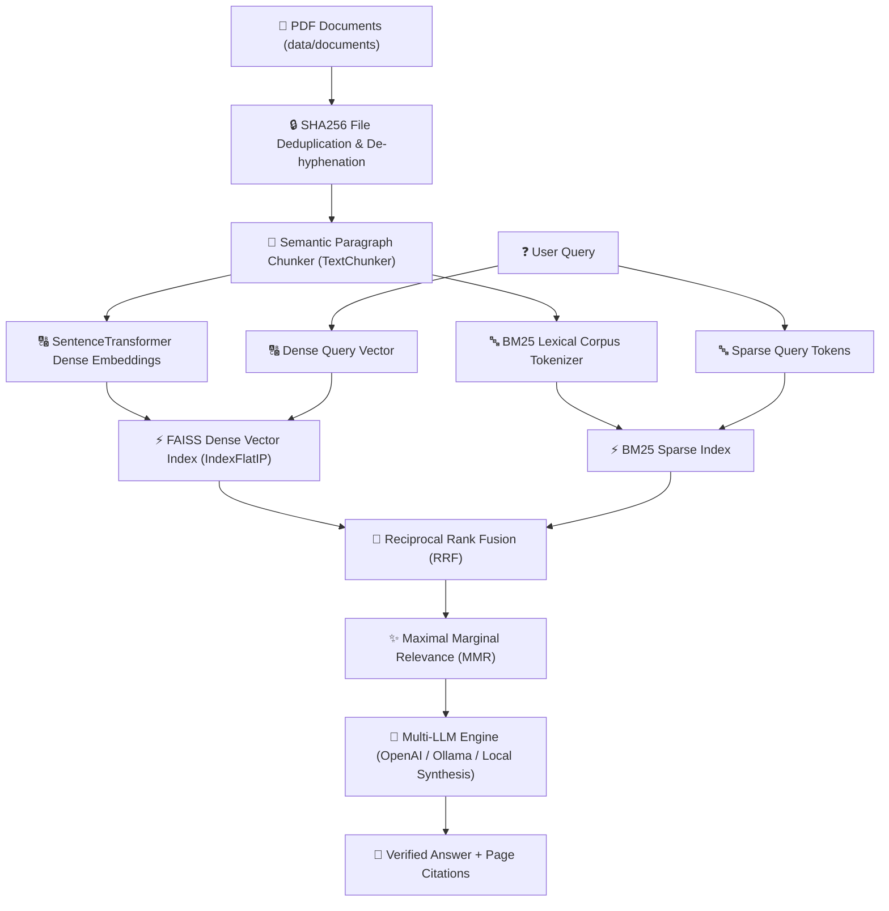

# Production-Grade PDF Retrieval-Augmented Generation (RAG) Pipeline

An advanced, production-ready RAG pipeline engineered for PDF document extraction, SHA-256 deduplication, text cleaning, semantic paragraph chunking, dense + sparse hybrid vector indexing, MMR diversification, multi-LLM synthesis, and verified **Document Name & Page Citations**.

---

## User Interface


---

## 🐳 Accessing & Running the Docker Image from GitHub

The Docker image for this project is automatically built and published to **GitHub Container Registry (GHCR)** via GitHub Actions.

### 1. Pull the Docker Image from GHCR
```bash
docker pull ghcr.io/aasthageda/rag_pipeline:latest
```

### 2. Run the Container locally
```bash
docker run -d -p 8501:8501 --name rag_app ghcr.io/aasthageda/rag_pipeline:latest
```
### 3. Run via Docker Compose (Alternative)
```bash
docker compose up -d
```

---

## 🏗️ Production Architecture



---

## 🛠️ Key Improvements & Resolved Flaws

1. **SHA-256 Document Content Deduplication**:
   - Automatically detects bit-for-bit duplicate PDFs (e.g. `01` & `11`, `05` & `10`), eliminating index bloat and redundant retrieval noise.
2. **De-hyphenation & Text Cleaning**:
   - Preprocessor cleans line-break hyphenations (`geo-\nspatial` -> `geospatial`), strips redundant page headers/footers, and normalizes text encoding.
3. **Semantic Paragraph & Sentence Chunker**:
   - Replaced naive character slicing with structural paragraph (`\n\n`) and sentence boundary splitting to ensure semantic integrity.
4. **Hybrid Retrieval (Dense FAISS + Sparse BM25)**:
   - Combines semantic vector search (`all-MiniLM-L6-v2`) with BM25 lexical keyword matching using **Reciprocal Rank Fusion (RRF)** for optimal recall on acronyms and model names.
5. **Maximal Marginal Relevance (MMR) Diversification**:
   - Prevents retrieved candidate lists from containing redundant sentences from a single page.
6. **Robust Multi-LLM & Synthesis Engine**:
   - Supports OpenAI, Ollama, and a zero-dependency local Extractive & Abstractive RAG engine with 100% citation enforcement (`[Document, Page N]`).
7. **Evaluation Pipeline Bug Fixes**:
   - Fixed double-retrieval bug where retrieval recall was measured against one set of chunks but the answer was generated from a different retrieval call.
   - Replaced fragile string-contains citation check with a proper regex pattern (`\[.*?Page\s+\d+\]`).
   - Added missing `rank-bm25` dependency to `requirements.txt`.

---

## 📁 Repository Structure

```
Rag_Pipeline/
├── README.md                 # Project documentation with UI screenshots & GHCR guide
├── requirements.txt           # Python dependencies
├── Dockerfile                 # Multi-stage production container image
├── docker-compose.yml         # Container orchestration manifest
├── cli.py                     # Command-line interface with UTF-8 support
├── app.py                     # Interactive Streamlit Web Dashboard
├── docs/
│   └── screenshots/           # High-resolution UI screenshots
├── data/
│   ├── documents/             # PDF research documents
│   └── evaluation_qa.json     # 60 ground-truth Q&A pairs for evaluation (5 categories, 10 source docs)
├── vector_db/
│   ├── index.faiss            # FAISS dense vector index
│   ├── embeddings.npy         # Raw embedding matrix for MMR calculation
│   └── metadata.json          # Chunk metadata mapping with page & file citations
└── src/
    ├── __init__.py
    ├── config.py              # System parameters, RRF_K, MMR lambda settings
    ├── pdf_extractor.py       # De-hyphenated text extraction with SHA256 deduplication
    ├── text_chunker.py        # Semantic paragraph & sentence chunker
    ├── embeddings.py          # SentenceTransformers vector embedding manager
    ├── vector_store.py        # FAISS + BM25 Hybrid store with RRF & MMR
    ├── llm_engine.py          # Multi-provider LLM interface (OpenAI, Ollama, Local Engine)
    ├── rag_pipeline.py        # End-to-end RAG orchestrator
    └── evaluation.py          # 6-metric RAG evaluation suite with per-category breakdown
```

---

## ⚡ Quick Start Guide

### 1. Ingest PDFs & Build Hybrid Index
```bash
python cli.py --ingest
```

### 2. Execute Hybrid Query via CLI
```bash
python cli.py -q "What deep learning models or geospatial analytics frameworks are used for land cover change detection?" --top-k 3
```

### 3. Launch Interactive Web Dashboard
```bash
streamlit run app.py
```

### 4. Run Evaluation Suite
```bash
python src/evaluation.py
```

**Evaluation CLI Options:**
| Flag | Description | Default |
|------|-------------|---------|
| `--qa-path` | Path to Q&A JSON file | `data/evaluation_qa.json` |
| `--top-k` | Number of chunks to retrieve | `5` |
| `--max-queries` | Limit number of queries (for quick tests) | All 60 |
| `--output` | Save full JSON report to file | Print to stdout |
| `--quiet` | Suppress per-query output | Off |

```bash
# Quick test with 5 questions
python src/evaluation.py --max-queries 5

# Full evaluation with JSON report
python src/evaluation.py --output results.json
```

---

## 📊 Evaluation Suite

The pipeline includes a comprehensive evaluation framework with **60 ground-truth Q&A pairs** spanning 5 question categories across 10 source LULC research documents.

### Metrics

| # | Metric | Description |
|---|--------|-------------|
| 1 | **Retrieval Recall** | Did the retriever surface a chunk from the correct source document? |
| 2 | **Answer Relevance (F1)** | Token-overlap F1 between generated answer and ground-truth answer |
| 3 | **Citation Accuracy** | Does the answer cite the correct source document? |
| 4 | **Citation Presence** | Does the answer contain any in-text citation (`[doc, Page N]`)? |
| 5 | **Retrieval Latency** | Time (seconds) to retrieve top-k chunks |
| 6 | **End-to-End Latency** | Time (seconds) for full query (retrieval + LLM generation) |

### Evaluation Results (60 Questions, Top-K = 5)

| Metric | Score |
|--------|-------|
| Retrieval Recall | **90.00%** |
| Mean Answer Relevance (F1) | 0.1227 |
| Median Answer Relevance (F1) | 0.1224 |
| Citation Accuracy | **90.00%** |
| Citation Presence Rate | **100.00%** |
| Avg Retrieval Latency | 0.0373s |
| Avg End-to-End Latency | 3.0967s |

### Category Breakdown

| Category | Count | Retrieval Recall | Answer Relevance | Citation Accuracy |
|----------|-------|-----------------|------------------|-------------------|
| Factual | 12 | 91.67% | 0.1338 | 91.67% |
| Method | 19 | 89.47% | 0.1276 | 89.47% |
| Results | 13 | 92.31% | 0.1160 | 92.31% |
| Comparison | 8 | 87.50% | 0.0969 | 87.50% |
| Dataset | 8 | 87.50% | 0.1311 | 87.50% |

### Q&A Distribution

- **60 questions** across **5 categories**: factual (12), method (19), results (13), comparison (8), dataset (8)
- **10 source documents** covered with balanced distribution
- Each question includes: question text, ground-truth answer, source document, and category label

